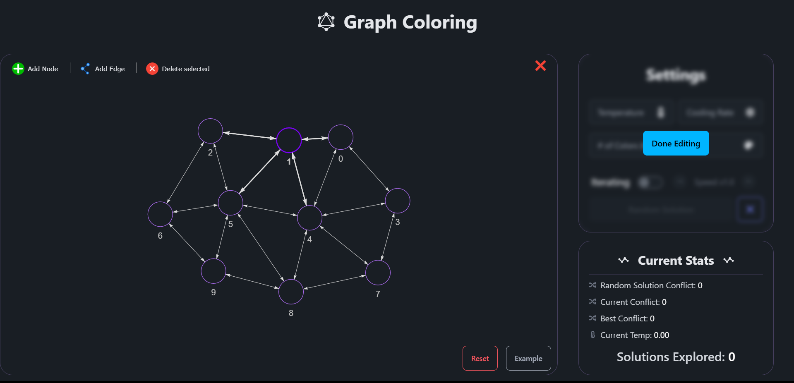
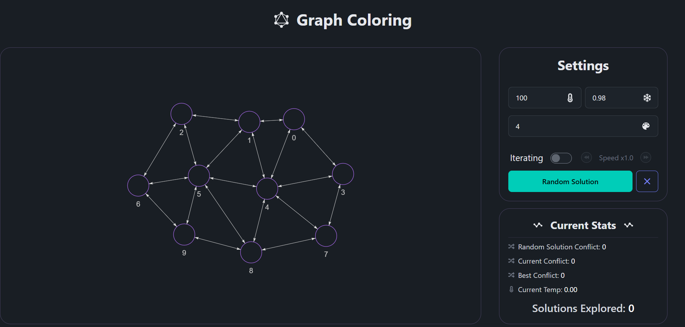
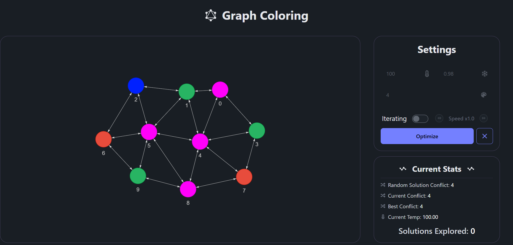
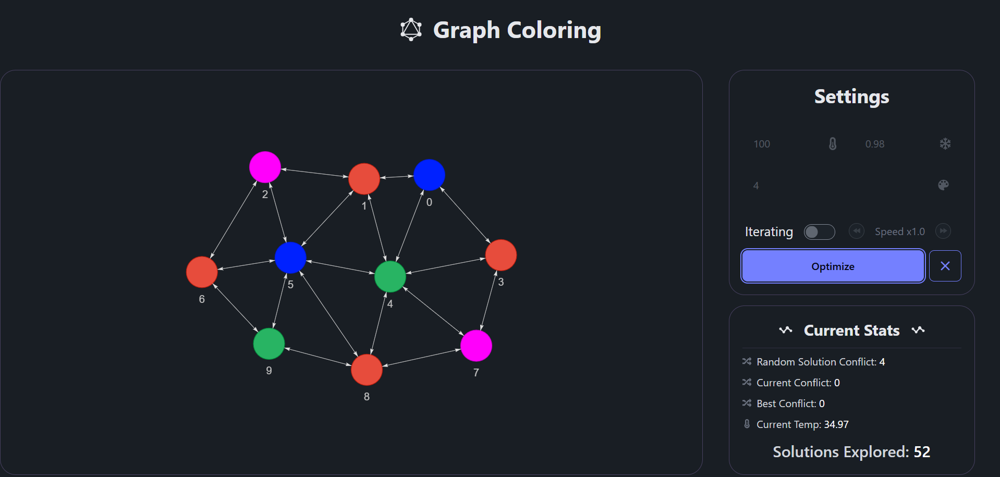

# Graph Coloring with Simulated Annealing

This project is a React-based tool to solve the graph coloring problem using the Simulated Annealing algorithm. The goal is to assign colors to each vertex of a graph so that no two adjacent vertices share the same color. This tool allows users to create graphs, configure parameters, and visualize the coloring process.

## Features

- **Graph Representation:** Users can create a graph via a graphical user interface (GUI) and see the graph structure represented visually.
- **Initial Solution:** Colors are randomly assigned to vertices from a set of colors. Users can choose the number of colors available for coloring the graph.
- **Simulated Annealing:** Users can adjust parameters such as temperature and cooling rate to control the annealing process.
- **Visualization:** The interface displays the progress of the algorithm, showing solutions explored and conflicts resolved.
- **Output:** The tool shows the best solution found, including color assignments for each vertex and the total number of conflicts.

## Technologies Used

- **React** with **TypeScript** for the frontend interface.
- **React Graph Vis** for graph visualization and manipulation.

## Preview
1. Set up the graph and initial values
   
   
2. Random solution 
   - Initial Temperature **100**
   - Cooling rate **98%**
   - Colors number **4**
   - Random solution conflict **4**

   
3. Optimizing
    - Optimized solution conflict **0**
    - Solutions explored 52
   
    
## Setup

1. Clone the repository:
   ```bash
   git clone https://github.com/engkareeem/Simulated-Annealing-Graph-Coloring.git
   ```
2. Navigate to the project folder:
   ```bash
   cd Simulated-Annealing-Graph-Coloring
   ```
3. Install dependencies:
   ```bash
   npm install
   ```
4. Start the development server:
   ```bash
   npm start
   ```
5. Open the application in your browser at `http://localhost:3000`.

## Usage

1. Adjust settings like temperature, cooling rate, and number of colors on the right-hand panel.
2. Click **Random Solution** to generate an initial color assignment.
3. Toggle **Iterating** to start the simulated annealing process. Adjust the speed as needed.
4. Observe the **Current Stats** panel for details on conflicts and solutions explored.

## Folder Structure

- `src/`: Contains all source files.
    - `components/`: UI components for the graph interface and settings panel.
    - `hooks/`: Custom hooks for managing state and the simulated annealing algorithm.
    - `utils/`: Helper functions for algorithm logic.

